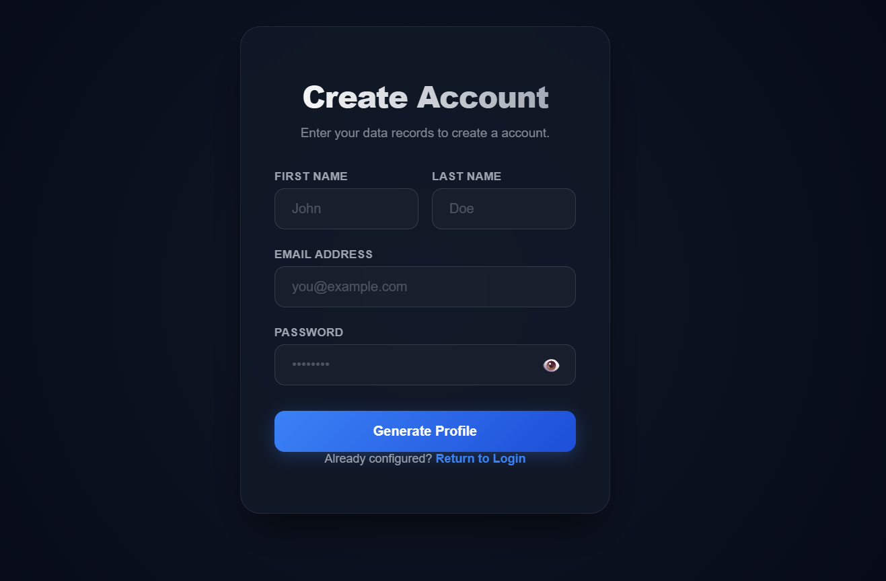
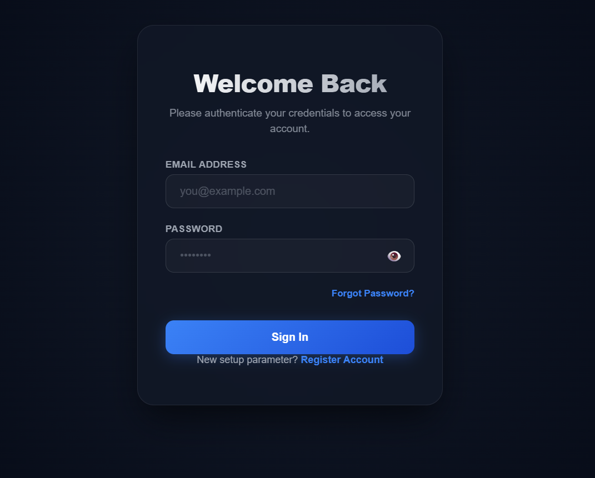

# Responsive Authentication Gateway

A lightweight, multi-device responsive full-stack authentication gateway engineered with React (Vite) on the frontend and Node.js (Express) on the backend. This project serves as a clean baseline layout focusing exclusively on a highly secure registration workflow, dynamic email verification, and full-stack login authentication sessions.

---

## 🛡️ Security Features & Design Tokens
* **HttpOnly Session Engine:** Tokens are securely dispatched using HTTP cookies, entirely mitigating client-side XSS scripting token extraction hazards.
* **Two-Way History Stack Gates:** Route layout guards automatically catch browser back/forward commands to prevent historical page context leaks.
* **Airtight Session Disconnects:** Logout events trigger a clean data context wipe alongside `window.location.replace` history state overrides.
* **Device Isolation Grid:** Layouts adapt seamlessly across ultrawide desktop panels, tablets, and smartphones.

---

## 🚀 Getting Started

### 📋 Prerequisites
* [Node.js](https://nodejs.org/) (v16.x or higher)
* [MongoDB](https://www.mongodb.com/) (Local or Atlas instance)

### 🛠️ 1. Backend Server Runtime Setup
1. Navigate to your server folder and install all framework dependencies:
```bash
   cd backend
   npm install
```


2.  Run your active Node.js server instance:

```bash
   npm start
   ```


### 💻 2. Frontend React Application Setup
1. Open a new terminal tab, navigate into your frontend folder, and install all user interface dependencies:

```bash
   cd frontend
   npm install
   ```
2. Boot up your local React architecture engine using the Vite development framework:

```bash
   npm run dev
   ```
## Screenshot


